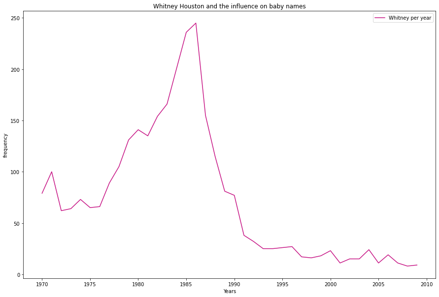

# Whitney Houston and the influence on baby names
In the second week project, I decided to analyze the influence of great artists in the name of children born and registered in US in the years of 1970-2010.
 
The chart above created using *Matplotlib* shows a parallel between the year when Whitney Houston released the music **I Wanna Dance With Somebody** in 1987 and how much the name grew in the number when compared to the previous years.
 

